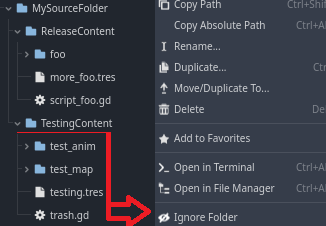
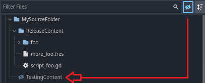

# Ignore Folders
Addon For Godot 4

This plugin allows you to mark folders to be **Ignored/Unignored** by the project,

This means that for any folder marked as ignored, the project will ignore its contents and references.

>[!WARNING]
>The folder marked as ignored will be ignored from the project, any reference to files included in the folder will no longer work!
>
>If you just want to hide the folder for a visually cleaner file system, you should use my other plugin called [Hide Folders](https://github.com/CodeNameTwister/HideFolders).

## Use Case
This is useful if you want to have a folder where your files won't be included in the project or its export, such as backups, .blend files, testing files, etc.

Also for scripts that you want to leave for later and that you have half done and that generate some type of error message in the console (gg bro)

## How Work
* In the File System Dock Press RMB (Right Mouse Button) in any folder of you want mark ignore/unignore.

* File System Dock has a button on top for show/hide ignored files, you can see the ignored folders at the end. (.godot not included)

## Preview

